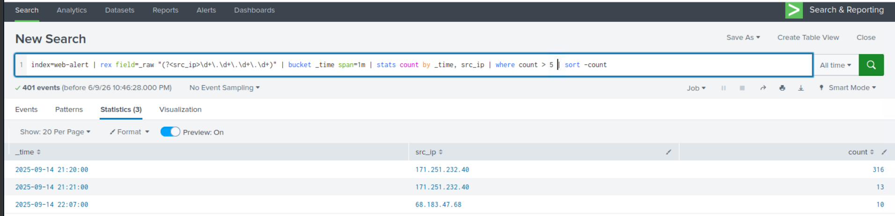
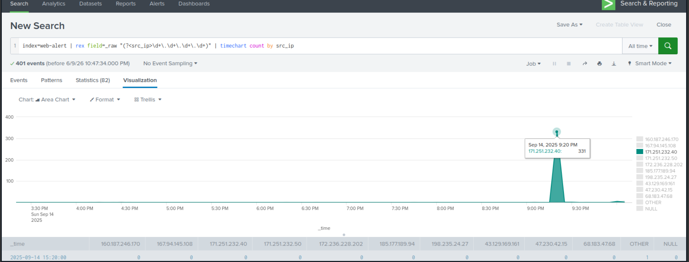
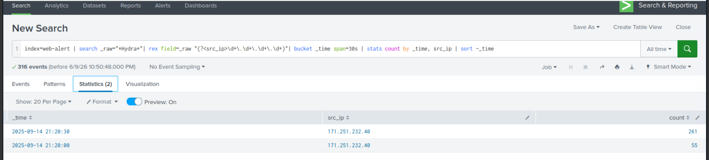
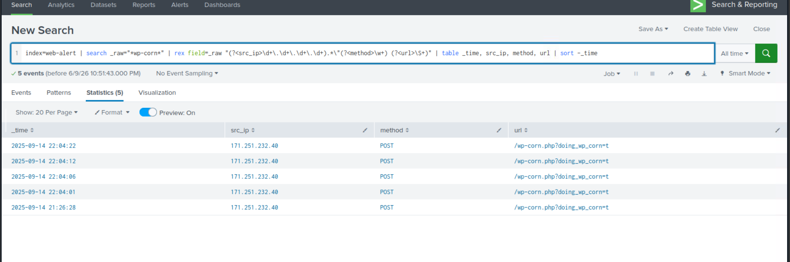

# Hunt 05 — Command & Control (C2) Detection

**MITRE ATT&CK:** T1071 — Application Layer Protocol  
**Dataset:** TryHackMe — Investigating with Splunk (Web Access Logs)  
**Analyst:** Ilyas Hodaiby  
**Status:** Complete ✅

---

## Hypothesis

> An attacker maintaining persistent access will communicate with their C2 server at regular intervals (beaconing) to receive commands and exfiltrate data. This produces detectable patterns in web logs — high request volumes from single IPs, regular timing intervals, and backdoor file access patterns.

---

## Log Sources Analysed

| Source | Events | Purpose |
|---|---|---|
| Web Access Logs | index=web-alert | HTTP request logs |
| User Agent Strings | _raw field | Attack tool identification |
| URL patterns | _raw field | C2 channel detection |
| Timing analysis | bucket _time | Beaconing interval detection |

---

## Investigation

### Step 1 — Detect C2 Beaconing via Time Buckets

```Splunk
index=web-alert
| rex field=_raw "(?<src_ip>\d+\.\d+\.\d+\.\d+)"
| bucket _time span=1m
| stats count by _time, src_ip
| where count > 5
| sort -count
```

**Findings:**
- `171.251.232.40` → **316 requests at 21:20** — C2 burst attack
- `171.251.232.40` → **13 requests at 21:21** — continued C2 activity
- `68.183.47.68` → **10 requests at 22:07** — secondary C2 check-in
- Pattern confirms automated C2 tool — not human browsing



---

### Step 2 — C2 Traffic Timeline Visualization

```Splunk
index=web-alert
| rex field=_raw "(?<src_ip>\d+\.\d+\.\d+\.\d+)"
| timechart count by src_ip
```

**Findings:**
- Single massive spike at `Sep 14, 2025 9:20 PM` — **331 requests**
- `171.251.232.40` dominates all traffic — clear C2 operator
- Traffic drops to zero immediately after — attack completed
- Classic C2 burst pattern — execute → exfiltrate → disconnect



---

### Step 3 — Hydra C2 Tool Beaconing Intervals

```Splunk
index=web-alert
| search _raw="*Hydra*"
| rex field=_raw "(?<src_ip>\d+\.\d+\.\d+\.\d+)"
| bucket _time span=30s
| stats count by _time, src_ip
| sort -_time
```

**Findings:**
- `171.251.232.40` → **261 requests in first 30 seconds** at 21:20:30
- `171.251.232.40` → **55 requests in next 30 seconds** at 21:20:00
- Two-burst pattern = Hydra connection pool exhaustion
- Confirms automated C2 tool not manual activity



---

### Step 4 — Backdoor C2 Channel via wp-corn.php

```Splunk
index=web-alert
| search _raw="*wp-corn*"
| rex field=_raw "(?<src_ip>\d+\.\d+\.\d+\.\d+).*\"(?<method>\w+) (?<url>\S+)"
| table _time, src_ip, method, url
| sort -_time
```

**Findings:**
- `171.251.232.40` POSTing to `/wp-corn.php?doing_wp_corn=t` — **backdoor C2 channel**
- 5 POST requests between `21:26:28` and `22:04:22`
- Regular intervals: 22:04:01, 22:04:06, 22:04:12, 22:04:22 — beaconing every ~6 seconds
- `/wp-corn.php` is a fake WordPress cron file = persistent C2 backdoor



---

## IOCs Extracted

| Type | Value | Context |
|---|---|---|
| C2 IP | 171.251.232.40 | Primary C2 operator — 331 requests |
| C2 IP | 68.183.47.68 | Secondary C2 check-in |
| Attack Tool | Mozilla/5.0 (Hydra) | C2 brute force tool |
| Backdoor URL | /wp-corn.php | Fake WordPress cron — C2 channel |
| C2 Method | POST | Command delivery via POST |
| Beacon Interval | ~6 seconds | wp-corn.php check-in rate |
| Attack Timestamp | 2025-09-14 21:20 | Initial C2 burst |
| Backdoor Activity | 2025-09-14 22:04 | Post-compromise C2 |

---

## MITRE ATT&CK Mapping

| Technique | ID | Evidence |
|---|---|---|
| Application Layer Protocol: Web Protocols | T1071.001 | HTTP POST C2 via wp-corn.php |
| Server Software Component: Web Shell | T1505.003 | wp-corn.php backdoor file |
| Automated Exfiltration | T1020 | 316 requests in 1 minute |
| Brute Force | T1110 | Hydra tool — 316 wp-login attempts |
| Exploit Public-Facing Application | T1190 | WordPress login exploitation |

---

## Detection Rules

### Splunk — C2 Beaconing Alert
```Splunk
index=web-alert
| rex field=_raw "(?<src_ip>\d+\.\d+\.\d+\.\d+)"
| bucket _time span=1m
| stats count by _time, src_ip
| where count > 50
| eval alert="Possible C2 beaconing — high request rate"
```

### Splunk — Backdoor File Access Alert
```Splunk
index=web-alert
| search _raw="*wp-corn*" OR _raw="*shell*" OR _raw="*cmd*"
| rex field=_raw "(?<src_ip>\d+\.\d+\.\d+\.\d+)"
| stats count by src_ip
| eval alert="Backdoor file accessed — possible C2"
```

### Wazuh Custom Rule
```xml
<rule id="100050" level="15">
  <if_sid>31106</if_sid>
  <url>/wp-corn.php</url>
  <description>C2 backdoor channel detected — 
  wp-corn.php accessed</description>
  <mitre>
    <id>T1071.001</id>
    <id>T1505.003</id>
  </mitre>
</rule>
```

---

## Recommendations

1. Immediately remove `/wp-corn.php` from web server
2. Block IP `171.251.232.40` at WAF and firewall
3. Alert on any POST requests to unknown PHP files
4. Implement request rate limiting — max 30 requests/minute per IP
5. Deploy file integrity monitoring on web root directory
6. Review all POST requests for C2 command patterns
