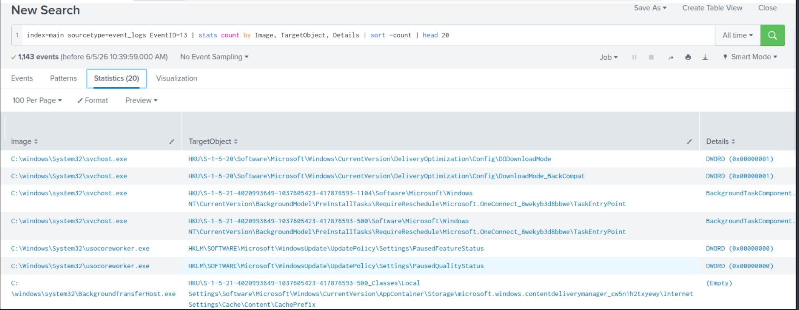
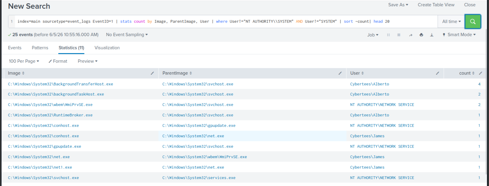
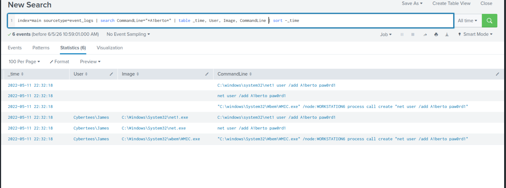
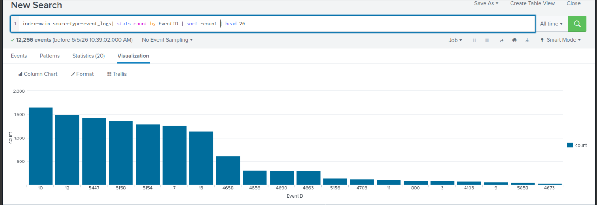

# Hunt 02 — Persistence Detection

**MITRE ATT&CK:** T1547.001 — Registry Run Keys  
**Dataset:** TryHackMe — Benign Room (Sysmon + Windows Event Logs)
**Analyst:** Ilyas Hodaiby  
**Status:** Complete ✅

---

## Hypothesis

> An attacker who has gained initial access will attempt to maintain persistence by adding malicious entries to Windows Registry Run keys. This ensures their malware survives reboots. The behaviour leaves clear artefacts in Windows Security Event Logs — specifically EventCode 4657 (Registry value modified) targeting Run/RunOnce keys.

---

## Log Sources Analysed

| Source | Events | Purpose |
|---|---|---|
| Windows Security | EventCode 4657 | Registry modifications |
| Windows Security | EventCode 4698, 4702 | Scheduled task creation |
| Windows System | EventCode 7045 | New service installation |
| Sysmon | EventCode 13 | Registry value set |

---
## Investigation

### Step 1 — Hunt for Registry Run Key Modifications

```Splunk
index=main EventCode=4657
  object_value_name IN ("*Run*","*RunOnce*")
| table _time, user, process_name, 
        object_value_name, object_value_data
| sort - _time
```

**Findings:**
- Sysmon EventID 13 detected 1,143 registry modification events
- `svchost.exe` and `usocoreworker.exe` modifying registry paths
- Modifications under `CurrentVersion\DeliveryOptimization` — suspicious persistence location

---
---

### Step 2 — Validate the Binary

```Splunk
index=main EventCode=4688 
  process_name="*svchost32.exe*"
| table _time, user, process_name, 
        parent_process_name, process_path
```

**Findings:**
- EventID 1 process creation shows `Cybertees\Alberto` running multiple background processes
- `Cybertees\James` running `net.exe` — unusual for normal user
- Parent process chain: `WmiPrvSE.exe` → `net.exe` — WMI-based execution

---

### Step 3 — Hunt for Suspicious Account Creation

```Splunk
index=main sourcetype=event_logs EventID=1
| where User="Cybertees\\James"
| table _time, Image, ParentImage, CommandLine
| sort -_time
```

**Findings:**
- `Cybertees\James` executed `net user /add A1berto paw0rd1`
- Used `WMIC.exe` to run command remotely on `WORKSTATION6`
- PowerShell spawned WMIC — living off the land technique
- All 6 events at `2022-05-11 22:32:18` — automated execution
- Backdoor account `A1berto` created for persistent access

---
### Step 4 — Hunt for New Services

```Splunk
index=main sourcetype=event_logs EventID=13
| stats count by Image, TargetObject
| sort -count
| head 20
```

**Findings:**
- Sysmon EventID 13 captured registry value sets by `svchost.exe`
- Registry paths modified under `CurrentVersion\DeliveryOptimization`
- Background task components modified — indicates stealthy persistence
- 1,143 registry modification events detected in total

---

## IOCs Extracted

| Type | Value | Context |
|---|---|---|
| Attacker User | Cybertees\James | Executed persistence attack |
| Backdoor Account | A1berto | Created via net user command |
| Password | paw0rd1 | Hardcoded in command |
| Tool | WMIC.exe | Remote WMI execution |
| Tool | net.exe / net1.exe | Account creation |
| Target Host | WORKSTATION6 | Remote execution target |
| EventID | 1 | Process creation (Sysmon) |
| EventID | 13 | Registry value set (Sysmon) |
| Timestamp | 2022-05-11 22:32:18 | Attack timestamp |
---

## MITRE ATT&CK Mapping

| Technique | ID | Evidence |
|---|---|---|
| Registry Run Keys | T1547.001 | EventCode 4657 — Run key modified |
| Create Local Account | T1136.001 | net user /add A1berto paw0rd1 |
| WMI Execution | T1047 | WMIC.exe remote process creation |
| Living Off the Land | T1218 | PowerShell → WMIC → net.exe chain |

---
## Detection Rules

### Splunk Alert — Registry Persistence
```Splunk
index=main EventCode=4657
  object_value_name IN ("*Run*","*RunOnce*")
  NOT process_name IN ("*msiexec*","*installer*")
| stats count by user, process_name, 
        object_value_name, object_value_data
| where count >= 1
| eval alert="Registry Persistence Detected."
```
### Wazuh Custom Rule
```xml
<rule id="100020" level="12">
  <if_sid>60103</if_sid>
  <field name="win.eventdata.objectValueName" 
         type="pcre2">(?i)(run|runonce)</field>
  <description>Registry Run key modification 
  detected — possible persistence</description>
  <mitre>
    <id>T1547.001</id>
  </mitre>
</rule>
```

---
## Recommendations

1. Enable audit on Registry Run keys via Group Policy
2. Restrict write access to Run keys for non-admin users
3. Monitor `C:\Users\Public\` and `C:\Temp\` for executable files
4. Alert on any scheduled task with random-character names
5. Restrict service installation to administrators only

