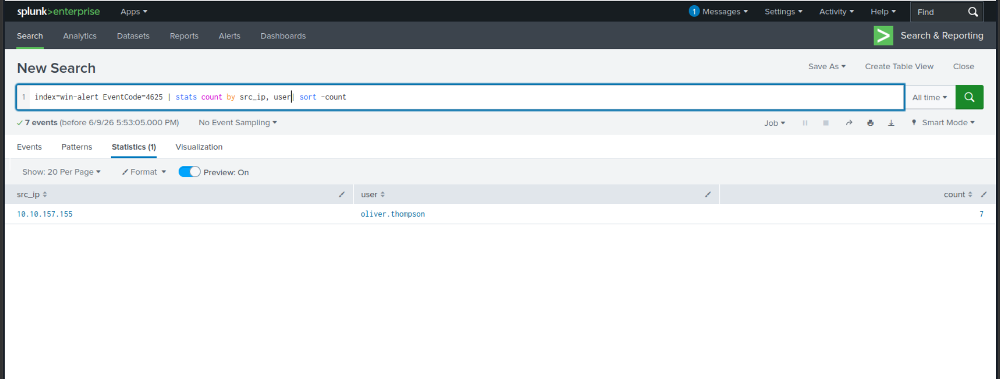
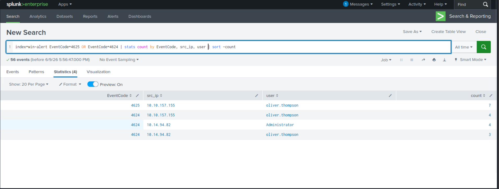
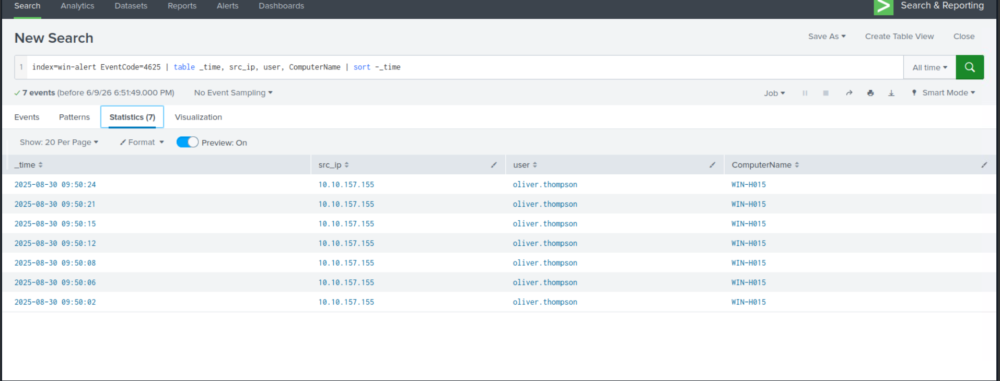
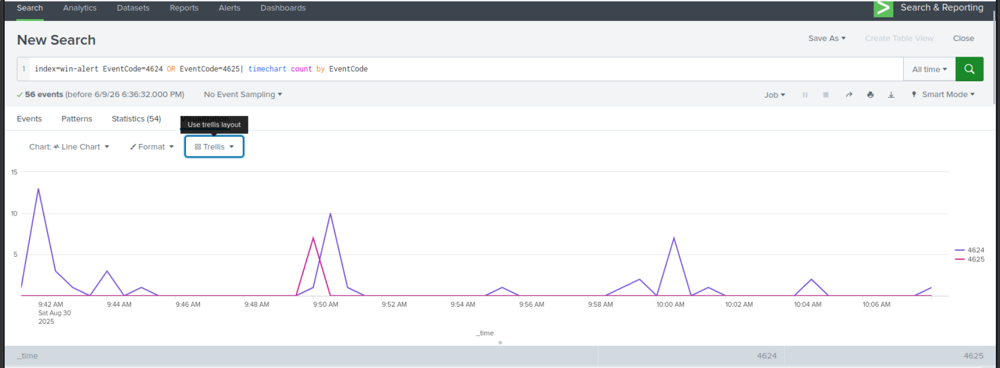

# Hunt 03 — Credential Access Detection

**MITRE ATT&CK:** T1110.001 — Brute Force: Password Guessing  
**Dataset:** TryHackMe — Investigating with Splunk (Windows Security Logs)  
**Analyst:** Ilyas Hodaiby  
**Status:** Complete ✅

---

## Hypothesis

> An attacker targeting a Windows environment will attempt to gain access by brute-forcing user credentials. This produces multiple failed login events (EventCode 4625) from a single source IP, followed by successful authentication (EventCode 4624) — a clear indicator of credential access via password guessing.

---

## Log Sources Analysed

| Source | Events | Purpose |
|---|---|---|
| Windows Security | EventCode 4625 | Failed login attempts |
| Windows Security | EventCode 4624 | Successful logins |
| Windows Security | LogonType 3 | Network-based authentication |

---

## Investigation

### Step 1 — Hunt for Failed Login Attempts

```Splunk
index=win-alert EventCode=4625
| stats count by src_ip, user
| sort -count
```

**Findings:**
- `oliver.thompson` account targeted from `10.10.157.155`
- 7 failed login attempts detected
- Single source IP targeting single account — automated brute force pattern



---

### Step 2 — Correlate Failed vs Successful Logins

```Splunk
index=win-alert EventCode=4625 OR EventCode=4624
| stats count by EventCode, src_ip, user
| sort -count
```

**Findings:**
- `10.10.157.155` → `oliver.thompson`: 7 failures (4625) then 4 successes (4624)
- `10.14.94.82` → `Administrator`: 4 successful logins
- `10.14.94.82` → `oliver.thompson`: 3 successful logins
- Pattern confirms brute force → successful compromise



---

### Step 3 — Detailed Timeline of Attack

```Splunk
index=win-alert EventCode=4625
| table _time, src_ip, user, ComputerName
| sort -_time
```

**Findings:**
- All 7 failed attempts against `WIN-H015`
- Attempts clustered between `09:50:02` and `09:50:24` — 22 seconds
- Rapid sequential attempts = automated tool (not manual)
- Target: `oliver.thompson` on `WIN-H015`



---

### Step 4 — Attack Timeline Visualization

```Splunk
index=win-alert EventCode=4624 OR EventCode=4625
| timechart count by EventCode
```

**Findings:**
- Clear spike at `09:50 AM` on `2025-08-30`
- 4625 (failures) peak then immediate 4624 (successes) — confirms compromise
- Activity continues across multiple time windows — persistent attacker



---

## IOCs Extracted

| Type | Value | Context |
|---|---|---|
| Attacker IP | 10.10.157.155 | Primary brute force source |
| Attacker IP | 10.14.94.82 | Secondary source — post-compromise |
| Target User | oliver.thompson | Brute forced account |
| Target User | Administrator | Also targeted |
| Target Host | WIN-H015 | Compromised machine |
| EventCode | 4625 | 7 failed login attempts |
| EventCode | 4624 | 11 successful logins total |
| Timeframe | 2025-08-30 09:50:02–09:50:24 | 22-second attack window |

---

## MITRE ATT&CK Mapping

| Technique | ID | Evidence |
|---|---|---|
| Brute Force: Password Guessing | T1110.001 | 7 x EventCode 4625 from single IP |
| Valid Accounts | T1078 | Successful login after brute force |
| Lateral Movement via Valid Accounts | T1021 | LogonType 3 from attacker IP |

---

## Detection Rules

### Splunk — Brute Force Alert
```Splunk
index=win-alert EventCode=4625
| stats count by src_ip, user
| where count >= 5
| eval alert="Possible Brute Force Attack"
| table _time, src_ip, user, count, alert
```

### Splunk — Brute Force then Success
```Splunk
index=win-alert EventCode=4625 OR EventCode=4624
| stats count by EventCode, src_ip, user
| eval status=if(EventCode=4625,"FAILED","SUCCESS")
| stats values(status) as attempts by src_ip, user
| where mvcount(attempts) > 1
| eval alert="Brute Force Followed by Success"
```

### Wazuh Custom Rule
```xml
<rule id="100030" level="12" frequency="5" timeframe="60">
  <if_matched_sid>60122</if_matched_sid>
  <same_source_ip/>
  <same_field>win.eventdata.targetUserName</same_field>
  <description>Brute Force: Multiple failed logins 
  from same IP against same user</description>
  <mitre>
    <id>T1110.001</id>
  </mitre>
</rule>
```

---

## Recommendations

1. Implement account lockout policy after 5 failed attempts
2. Enable Multi-Factor Authentication (MFA) for all accounts
3. Block IP `10.10.157.155` at firewall level
4. Alert on 5+ failed logins from same IP within 60 seconds
5. Review all successful logins from `10.14.94.82` for lateral movement
