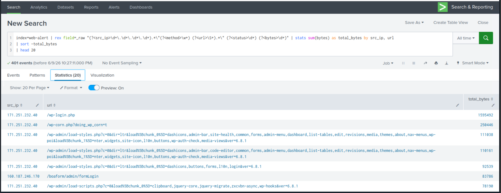
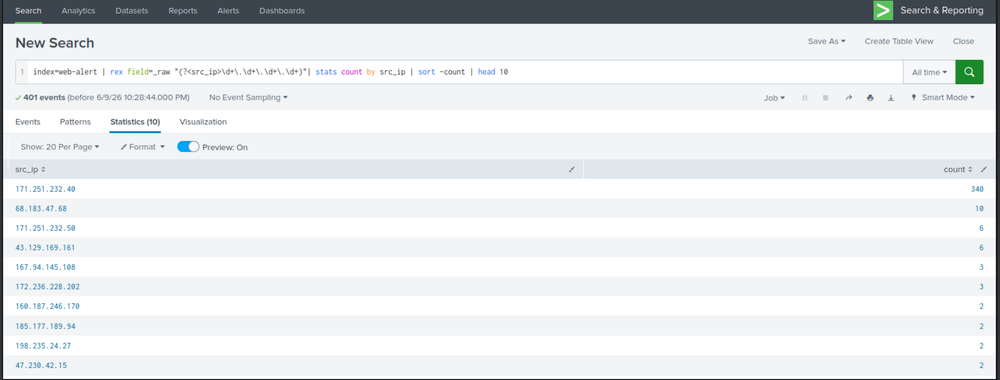
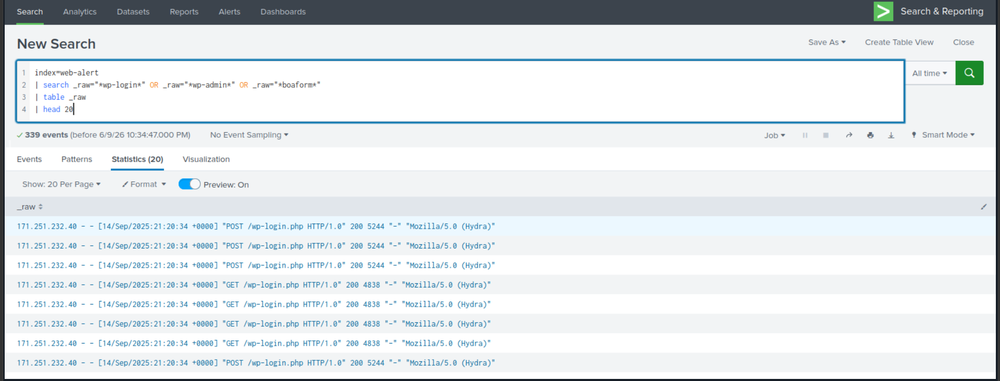
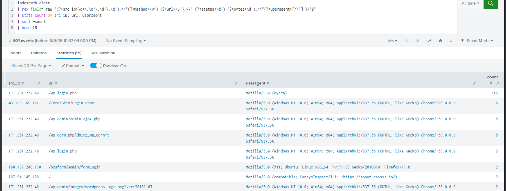

# Hunt 04 — Web Attack & Data Exfiltration Detection

**MITRE ATT&CK:** T1190 — Exploit Public-Facing Application  
**Dataset:** TryHackMe — Investigating with Splunk (Web Access Logs)  
**Analyst:** Ilyas Hodaiby  
**Status:** Complete ✅

---

## Hypothesis

> An attacker targeting a web application will use automated tools to brute force authentication pages, then access admin panels to exfiltrate data. This produces anomalous HTTP traffic patterns — high request volumes from single IPs using attack tool user agents — detectable through web log analysis.

---

## Log Sources Analysed

| Source | Events | Purpose |
|---|---|---|
| Web Access Logs | index=web-alert | HTTP request logs |
| User Agent Strings | _raw field | Tool identification |
| URL patterns | _raw field | Attack surface mapping |

---

## Investigation

### Step 1 — Baseline Web Traffic by Volume

```Splunk
index=web-alert
| rex field=_raw "(?<src_ip>\d+\.\d+\.\d+\.\d+).*\"(?<method>\w+) (?<url>\S+).*\" (?<status>\d+) (?<bytes>\d+)"
| stats sum(bytes) as total_bytes by src_ip, url
| sort -total_bytes
| head 20
```

**Findings:**
- `171.251.232.40` → `/wp-login.php` → **1,595,492 bytes** — massive traffic volume
- `171.251.232.40` → `/wp-corn.php?doing_wp_corn=t` — **backdoor file accessed**
- `171.251.232.40` → `/wp-admin/` — WordPress admin panel access
- `160.187.246.170` → `/boaform/admin/formLogin` — router exploit attempt



---

### Step 2 — Identify Top Attacking IPs

```Splunk
index=web-alert
| rex field=_raw "(?<src_ip>\d+\.\d+\.\d+\.\d+)"
| stats count by src_ip
| sort -count
| head 10
```

**Findings:**
- `171.251.232.40` — **340 requests** — primary attacker
- `68.183.47.68` — 10 requests
- `171.251.232.50` — 6 requests
- `43.129.169.161` — 6 requests — login page scanning
- Multiple IPs scanning for vulnerabilities



---

### Step 3 — Detect Hydra Brute Force Tool

```Splunk
index=web-alert
| search _raw="*wp-login*" OR _raw="*wp-admin*" OR _raw="*boaform*"
| table _raw
| head 20
```

**Findings:**
- User agent `Mozilla/5.0 (Hydra)` detected — **Hydra password cracker**
- `171.251.232.40` using Hydra against `/wp-login.php`
- POST and GET requests in rapid succession — automated attack
- Status 200 responses — attack reaching the login page successfully
- Timestamp: `14/Sep/2025 21:20:34` — all same second = automated



---

### Step 4 — Full Attack Summary

```Splunk
index=web-alert
| rex field=_raw "(?<src_ip>\d+\.\d+\.\d+\.\d+).*\"(?<method>\w+) (?<url>\S+).*\" (?<status>\d+) (?<bytes>\d+).*\"(?<useragent>[^\"]+)\"$"
| stats count by src_ip, url, useragent
| sort -count
| head 15
```

**Findings:**
- `171.251.232.40` → `/wp-login.php` → **316 requests** using Hydra
- `43.129.169.161` → `/Core/Skin/Login.aspx` — ASP.NET login scanning
- `171.251.232.40` → `/wp-corn.php` — backdoor persistence file
- `160.187.246.170` → `/boaform/admin/formLogin` — IoT/router exploit
- `167.94.145.108` → `/` — CensysInspect scanner — reconnaissance



---

## IOCs Extracted

| Type | Value | Context |
|---|---|---|
| Attacker IP | 171.251.232.40 | Primary — 340 requests via Hydra |
| Attacker IP | 160.187.246.170 | Router exploit attempts |
| Attacker IP | 43.129.169.161 | ASP.NET login scanning |
| Attacker IP | 167.94.145.108 | CensysInspect reconnaissance |
| Attack Tool | Mozilla/5.0 (Hydra) | Password brute force tool |
| Target URL | /wp-login.php | WordPress login — 316 hits |
| Backdoor URL | /wp-corn.php | Fake cron — persistence file |
| Target URL | /boaform/admin/formLogin | Router/IoT exploit |
| Data Volume | 1,595,492 bytes | Total from /wp-login.php |
| Timestamp | 2025-09-14 21:20:34 | Attack timestamp |

---

## MITRE ATT&CK Mapping

| Technique | ID | Evidence |
|---|---|---|
| Exploit Public-Facing Application | T1190 | WordPress login brute force |
| Brute Force | T1110 | 316 requests via Hydra tool |
| Server Software Component: Web Shell | T1505.003 | /wp-corn.php backdoor file |
| Active Scanning | T1595 | CensysInspect reconnaissance |
| Valid Accounts | T1078 | Admin panel access after brute force |

---

## Detection Rules

### Splunk — Hydra Detection
```Splunk
index=web-alert
| search _raw="*Hydra*"
| rex field=_raw "(?<src_ip>\d+\.\d+\.\d+\.\d+)"
| stats count by src_ip
| where count > 10
| eval alert="Hydra brute force tool detected"
```

### Splunk — High Request Rate Alert
```Splunk
index=web-alert
| rex field=_raw "(?<src_ip>\d+\.\d+\.\d+\.\d+)"
| bucket _time span=1m
| stats count by _time, src_ip
| where count > 50
| eval alert="High request rate — possible brute force"
```

### Wazuh Custom Rule
```xml
<rule id="100040" level="12">
  <if_sid>31106</if_sid>
  <url>/wp-login.php</url>
  <same_source_ip/>
  <description>WordPress brute force attack detected</description>
  <mitre>
    <id>T1110</id>
  </mitre>
</rule>
```

---

## Recommendations

1. Block IP `171.251.232.40` at WAF/firewall immediately
2. Implement rate limiting on `/wp-login.php` — max 5 attempts per minute
3. Deploy Web Application Firewall (WAF) to block known attack tools
4. Remove or rename `/wp-corn.php` — investigate for backdoor
5. Enable WordPress login lockout plugin
6. Monitor for `Hydra` user agent string in all web logs
