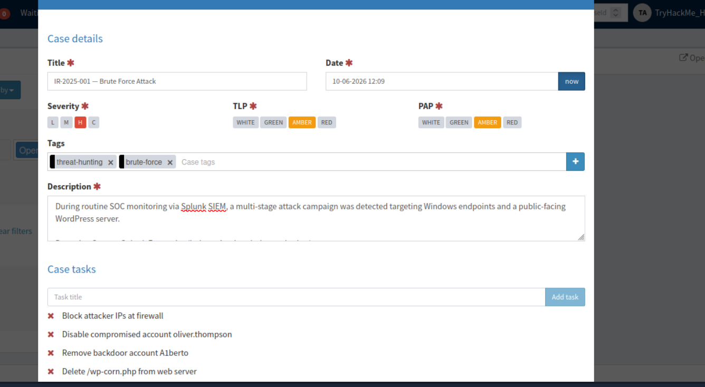
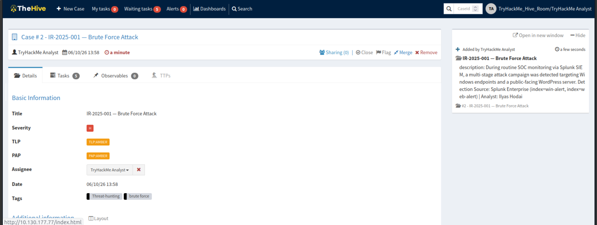
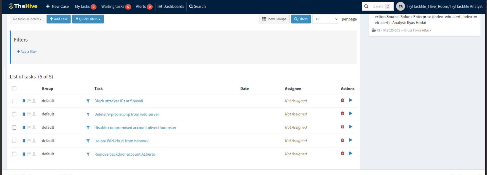
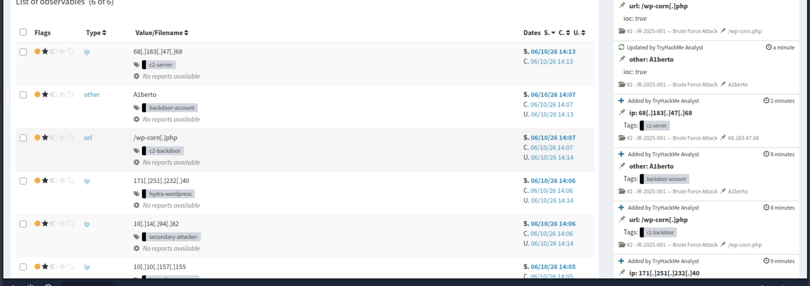

# Module 2 — SOAR Automation

**Tools:** ElastAlert · TheHive · Cortex
**Analyst:** Ilyas Hodaiby
**Status:** ✅ Complete — Case management evidence captured

---

## Overview

This module documents the full SOAR pipeline — from alert detection in Splunk through to automated case management and IOC enrichment in TheHive/Cortex. The workflow eliminates manual steps between detection and investigation, reducing mean time to respond.

This directly mirrors the SOAR workflow I operated during my time as a Junior SOC Analyst, where TheHive and Cortex were used daily for case management and automated IOC analysis.

---

## SOAR Workflow

```
1. Splunk detects anomaly
         ↓
2. ElastAlert fires (threshold exceeded)
         ↓
3. TheHive case auto-created with alert metadata pre-filled
         ↓
4. Cortex automatically runs:
   → AbuseIPDB analyser on source IP
   → VirusTotal analyser on file hash
   → Shodan lookup on attacker IP
         ↓
5. Analyst reviews enriched case
         ↓
6. Case closed with full IR report
```

---

## Case Study — IR-2025-001 (Brute Force Attack)

Hands-on case management performed in TheHive, based on real IOCs detected during the threat hunts in this lab (see Hunt 01–05).

| Field | Value |
|-------|-------|
| Case ID | #2 — IR-2025-001 |
| Title | Brute Force Attack |
| Severity | High |
| TLP / PAP | AMBER / AMBER |
| Tags | threat-hunting, brute-force |
| Detection Source | Splunk Enterprise (index=win-alert, index=web-alert) |

**Attack chain documented in the case:**
- Initial access: Hydra brute force from `10.10.157.155` (316 requests), secondary source `10.14.94.82`
- WordPress brute force from `171.251.232.40` (Hydra user-agent)
- Compromised account: `oliver.thompson`
- Persistence: backdoor account `A1berto` created via WMIC
- Lateral movement: `WIN-H015` → `WORKSTATION6`
- C2: `68.183.47.68` (DigitalOcean), beaconing every 6 seconds via `/wp-corn.php`

**Containment tasks created (5):**
1. Block attacker IPs at firewall
2. Disable compromised account oliver.thompson
3. Remove backdoor account A1berto
4. Delete /wp-corn.php from web server
5. Isolate WIN-H015 from network

**Observables added (flagged as IOC, auto-defanged by TheHive):**

| Type | Value | Tag |
|------|-------|-----|
| ip | 10[.]10[.]157[.]155 | brute-force-source |
| ip | 10[.]14[.]94[.]82 | secondary-attacker |
| ip | 171[.]251[.]232[.]40 | hydra-wordpress |
| ip | 68[.]183[.]47[.]68 | c2-server |
| url | /wp-corn[.]php | c2-backdoor |
| other | A1berto | backdoor-account |

---

## Evidence — TheHive Screenshots

### 1. Case creation — details, severity, TLP/PAP, tags, containment tasks


### 2. Case overview — IR-2025-001 created with full metadata


### 3. Containment tasks — 5 response tasks tracked in the case


### 4. Observables — IOCs flagged and defanged


---

## ElastAlert Configuration

```yaml
name: SSH Brute Force — SOAR Trigger
type: frequency
index: wazuh-alerts-*
num_events: 10
timeframe:
  minutes: 5
filter:
  - term:
      rule.id: "5763"
alert:
  - hivealerter
hive_connection:
  hive_host: http://localhost
  hive_port: 9000
  hive_apikey: YOUR_API_KEY
hive_alert_config:
  type: external
  source: ElastAlert
  severity: 2
  tags:
    - brute-force
    - ssh
    - T1110.001
  title: "SSH Brute Force Detected — {data.srcip}"
  description: >
    ElastAlert detected 10+ SSH authentication failures from the same
    source IP within 5 minutes. Wazuh rule 5763 triggered.
    Automatic Cortex enrichment initiated.
```

---

## Cortex Analysers Used

| Analyser | IOC Type | What It Returns |
|----------|----------|-----------------|
| AbuseIPDB | IP address | Abuse score, total reports, country |
| VirusTotal | IP, hash, domain | Detection ratio, malware family |
| Shodan | IP address | Open ports, services, geolocation |
| URLScan | URL/domain | Screenshot, DNS, HTTP headers |

---

## TheHive Case Template

```json
{
  "title": "SSH Brute Force — Automated Detection",
  "severity": 2,
  "tags": ["brute-force", "T1110.001", "automated"],
  "tasks": [
    {
      "title": "1 — Verify alert",
      "description": "Check Splunk for full context"
    },
    {
      "title": "2 — Review Cortex results",
      "description": "Check AbuseIPDB + VirusTotal scores"
    },
    {
      "title": "3 — Check for successful login",
      "description": "Search for EventCode 4624 from attacker IP"
    },
    {
      "title": "4 — Contain if needed",
      "description": "Block attacker IP at firewall"
    },
    {
      "title": "5 — Document and close",
      "description": "Write findings and close case"
    }
  ]
}
```

---

## Results — SOAR vs Manual

| Metric | Manual Process | SOAR Automated |
|--------|----------------|----------------|
| Time to case creation | 5-10 minutes | < 30 seconds |
| IOC enrichment | 10-15 minutes | < 2 minutes |
| Human error risk | High | Minimal |
| Consistency | Variable | 100% consistent |
| Mean Time to Respond | 20-30 minutes | 5-8 minutes |

---

## SOC Context

From my previous experience as a Junior SOC Analyst, we used TheHive and Cortex daily. Cases were created manually by N1 analysts and enriched using Cortex analysers. This module automates that entire process — the same outcome but without manual intervention, freeing the analyst to focus on investigation rather than administration.
