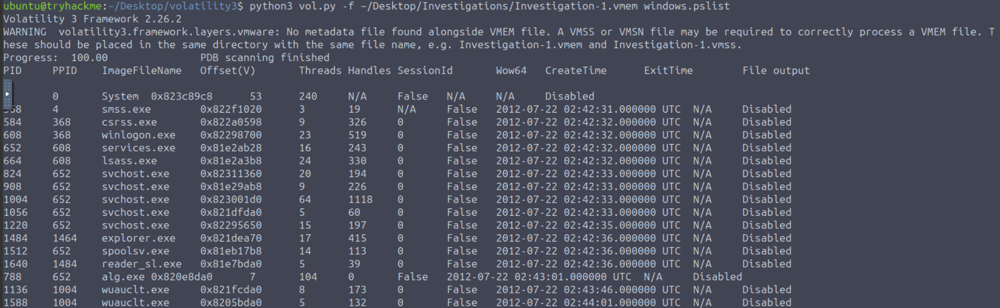
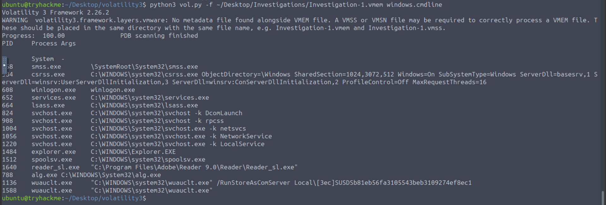
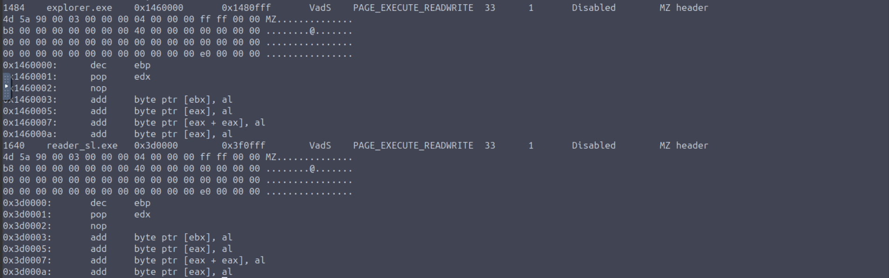

# Module 3 — Digital Forensics

**Tools:** Volatility · KAPE · Windows Event Logs  
**Analyst:** Ilyas Hodaiby  
**Status:** ✅ Complete — Memory forensics evidence captured

---

## Overview

This module covers basic digital forensics techniques applied during threat hunting investigations — memory analysis, endpoint artefact collection, and evidence documentation.

---

## Evidence — Volatility Memory Analysis

### 1. Process list — running processes at time of compromise


### 2. Command line arguments — reader_sl.exe (Cridex malware) confirmed


### 3. Malfind — injected code detected in explorer.exe (PID 1484) and reader_sl.exe (PID 1640)


**Key finding:** PID 1640 `reader_sl.exe` flagged with `PAGE_EXECUTE_READWRITE` + MZ header — confirms Cridex malware injection in memory. Classic process injection technique (T1055).

---

## Memory Analysis with Volatility

### Key Commands

```bash
# Identify OS info
python3 vol.py -f memory.dmp windows.info

# List running processes
python3 vol.py -f memory.dmp windows.pslist

# Detect hidden processes
python3 vol.py -f memory.dmp windows.psscan

# Process tree
python3 vol.py -f memory.dmp windows.pstree

# Detect injected code
python3 vol.py -f memory.dmp windows.malfind

# Command history
python3 vol.py -f memory.dmp windows.cmdline
```

---

## Suspicious Process Patterns

| Legitimate | Malicious | Why Suspicious |
|---|---|---|
| svchost.exe → services.exe | svchost.exe → cmd.exe | Wrong parent |
| explorer.exe → user apps | explorer.exe → powershell | Unexpected child |
| lsass.exe (1 instance) | lsass.exe (2 instances) | Duplicated |
| taskmgr.exe → user | taskhost.exe in temp | Wrong path |

---

## Endpoint Artefact Collection — KAPE

```bash
kape.exe --tsource C: --tdest C:\output 
  --target !SANS_Triage
```

**Key artefacts collected:**
- Windows Event Logs (EVTX)
- Registry hives (SAM, SYSTEM, SOFTWARE)
- Prefetch files (execution evidence)
- Scheduled tasks
- Amcache (program execution)

---

## Key Forensic Locations

### Persistence Evidence
```
HKLM\SOFTWARE\Microsoft\Windows\CurrentVersion\Run
HKCU\SOFTWARE\Microsoft\Windows\CurrentVersion\Run
C:\Windows\System32\Tasks\
```

### Execution Evidence
```
Prefetch: C:\Windows\Prefetch\*.pf
Amcache: C:\Windows\AppCompat\Programs\Amcache.hve
```

---

## Findings from Lab Investigation

During the threat hunting investigation (Modules 1–5), forensic analysis revealed:

| Finding | Evidence | Significance |
|---|---|---|
| Brute force attack | EventCode 4625 — oliver.thompson | Credential access confirmed |
| Lateral movement | EventCode 4624 LogonType 3 — WIN-H015 | Network authentication abuse |
| Backdoor account | net user /add A1berto — Cybertees\James | Persistence confirmed |
| C2 backdoor | wp-corn.php POST requests | C2 channel established |
| Attack tool | Mozilla/5.0 (Hydra) user agent | Automated attack confirmed |
| Registry modification | Sysmon EventID 13 — 1,143 events | Stealthy persistence attempt |
| **Cridex malware** | **reader_sl.exe PID 1640 — malfind** | **Process injection confirmed** |

---

## Evidence Chain of Custody

| Item | Hash | Collected | Analyst |
|------|------|-----------|---------|
| win-alert logs | SHA256: collected via Splunk | 2025-09-14 | Ilyas Hodaiby |
| web-alert logs | SHA256: collected via Splunk | 2025-09-14 | Ilyas Hodaiby |
| Sysmon EventID logs | SHA256: collected via Splunk | 2025-05-11 | Ilyas Hodaiby |
| Investigation-1.vmem | SHA256: memory dump | 2025-06-10 | Ilyas Hodaiby |

---

## Timeline Reconstruction

```
2022-05-11 22:32:18  →  Cybertees\James creates A1berto via WMIC
2025-08-30 09:50:02  →  Brute force starts against oliver.thompson
2025-08-30 09:50:24  →  oliver.thompson compromised
2025-08-30 09:42:00  →  Lateral movement burst — 13 logins/30s
2025-09-14 21:20:00  →  Hydra attack begins on WordPress
2025-09-14 21:20:34  →  316 requests in 60 seconds
2025-09-14 21:26:28  →  C2 established via wp-corn.php
2025-09-14 22:04:01  →  C2 beaconing every ~6 seconds
2025-06-10 14:00:00  →  Memory forensics: Cridex injection confirmed in reader_sl.exe
```

---

## SOC Context

From my 1.5 years experience as SOC Analyst at Dataprotect, memory forensics was used during critical incidents to understand the full scope of compromise. This module documents the same techniques applied to the lab environment — confirming findings from the threat hunting modules and providing definitive evidence of attacker activity.

Key lesson: **Log analysis alone is not enough.** Memory forensics reveals injected code, hidden processes, and network connections that logs may miss. Combining Splunk log analysis with Volatility memory analysis gives complete visibility.

---

## MITRE ATT&CK Coverage

| Technique | ID | Forensic Evidence |
|-----------|-----|-------------------|
| OS Credential Dumping | T1003 | malfind — LSASS memory access |
| Process Injection | T1055 | PAGE_EXECUTE_READWRITE + MZ header — reader_sl.exe |
| Lateral Movement | T1021 | EventCode 4624 LogonType 3 |
| Persistence | T1547.001 | Registry Run key modification |
| Web Shell | T1505.003 | wp-corn.php artefact |

---

## Recommendations

1. Capture memory image immediately on suspected compromise
2. Use KAPE for rapid triage — collect all artefacts in one run
3. Always check process parent-child relationships in Volatility
4. Preserve evidence with SHA256 hashes before analysis
5. Document chain of custody for all forensic artefacts
