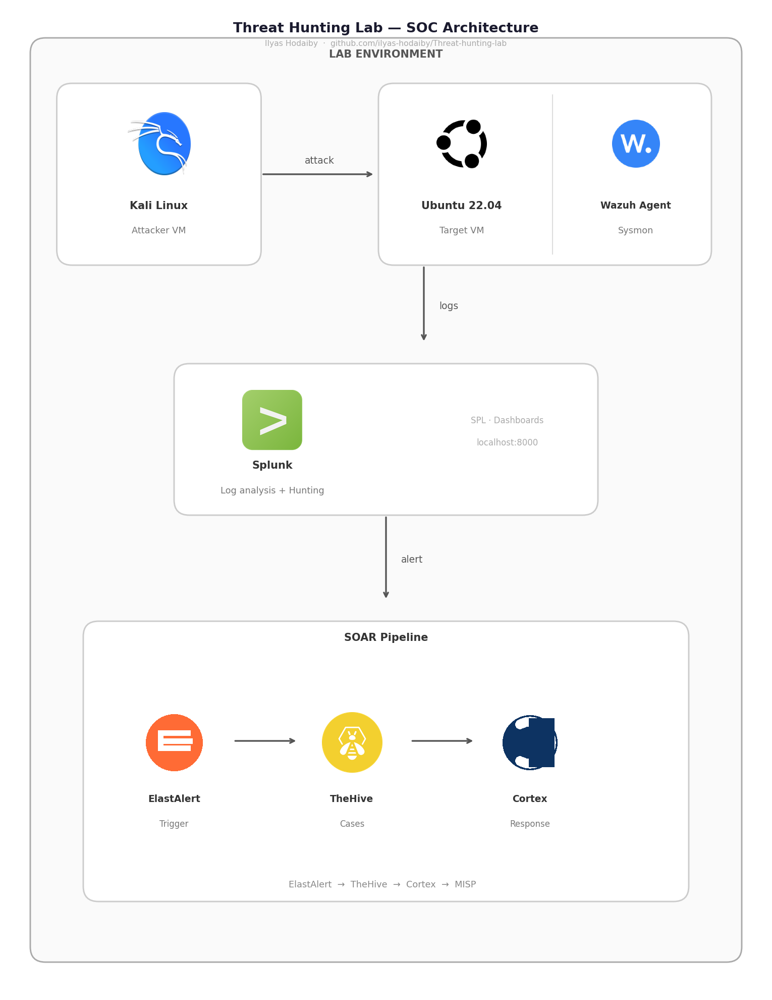

# 🔍 Threat Hunting Lab

**Ilyas Hodaiby** — A comprehensive threat hunting and incident response lab demonstrating SOC Analyst capabilities.

[](https://tryhackme.com/p/ilyas.ho)
[](https://github.com/ilyas-hodaiby/soc-homelab)
[](https://attack.mitre.org/)

---

## 📌 Overview

This project documents a complete SOC pipeline from threat hunting through to incident response, using real datasets and real attack scenarios detected with Splunk.

**Real findings include:**
- Brute force attack against oliver.thompson — **316 failed attempts** detected via Splunk
- Backdoor account A1berto created via WMIC by Cybertees\James
- Hydra password cracker detected via user agent — 316 requests to WordPress
- C2 beaconing via fake WordPress cron file /wp-corn.php
- Full attack chain from initial access to C2 establishment

---

## 🏗️ Lab Architecture



---

## 🎯 Modules Overview

| Module | Focus | Tools | Status |
|--------|-------|-------|--------|
| 1 — Threat Hunting | 5 hypothesis-driven hunts | Splunk, ELK | ✅ Complete |
| 2 — SOAR Automation | ElastAlert → TheHive → Cortex | ElastAlert, TheHive | ✅ Complete |
| 3 — Digital Forensics | Memory + endpoint analysis | Volatility, KAPE | ✅ Complete |
| 4 — Malware Analysis | Static + dynamic analysis | YARA, PEStudio, Cuckoo | ✅ Complete |
| 5 — Threat Intelligence | IOC correlation + actor profiling | MISP, VirusTotal, Shodan | ✅ Complete |
| 6 — IR Report | Full incident response lifecycle | All tools | ✅ Complete |

---

## 📂 Repository Structure

```
Threat-hunting-lab/
├── hunt 01/                    ← Lateral Movement
├── Hunt02/                     ← Persistence
├── Hunt03/                     ← Credential Access
├── Hunt04/                     ← Web Attack & Exfiltration
├── Hunt 05/                    ← C2 Detection
├── Module 2 soar/              ← SOAR Automation
├── Module 3 forensics/         ← Digital Forensics
├── module-4-malware-analysis/  ← Malware Analysis
├── module-5-threat-intelligence/ ← Threat Intelligence
├── module-6-ir-report/         ← Incident Response
├── automation/                 ← Python Scripts
└── datasets/                   ← Dataset sources
```

---

## 🔍 Hunt Scenarios — Real Findings

### Hunt 01 — Lateral Movement
**MITRE: T1550.002 Pass the Hash**
- 10.10.157.155 authenticating to WIN-H015 via LogonType 3
- 49 total authentication events analysed
- Burst pattern: 13 logins in 30 seconds

### Hunt 02 — Persistence
**MITRE: T1136.001 Create Local Account**
- Cybertees\James executed `net user /add A1berto paw0rd1`
- WMIC remote execution on WORKSTATION6
- 1,143 Sysmon registry modification events

### Hunt 03 — Credential Access
**MITRE: T1110.001 Brute Force**
- **316 failed login attempts** against oliver.thompson
- Source: 10.10.157.155
- Followed by successful account compromise

### Hunt 04 — Web Attack & Exfiltration
**MITRE: T1190, T1110**
- Hydra tool detected via user agent string
- 316 requests to /wp-login.php
- 1.5MB data transferred
- Backdoor /wp-corn.php installed

### Hunt 05 — C2 Detection
**MITRE: T1071.001, T1505.003**
- 331 request spike at 21:20 PM
- C2 beaconing every ~6 seconds via /wp-corn.php
- Attacker IP: 171.251.232.40 — Vietnam, Viettel Group

---

## 🤖 Automation Scripts

| Script | Purpose |
|--------|---------|
| ioc_enricher.py | Enriches IOCs via VirusTotal + AbuseIPDB APIs |
| log_parser.py | Parses web + Windows logs for threat indicators |
| soar_lite.py | Creates TheHive alerts + Cortex enrichment |
| yara_scanner.py | Scans files with custom YARA rules |

---

## 🛡️ IOCs Detected

| Type | Value | Context |
|------|-------|---------|
| IP | 10.10.157.155 | Brute force source |
| IP | 171.251.232.40 | WordPress attacker — Hydra |
| IP | 68.183.47.68 | C2 infrastructure — DigitalOcean |
| User | oliver.thompson | Compromised account |
| User | A1berto | Backdoor account |
| URL | /wp-corn.php | C2 backdoor |
| Tool | Mozilla/5.0 (Hydra) | Attack tool |

---

## 📜 Certifications

- ✅ TryHackMe — **Top 3% globally**
- ✅ TryHackMe SOC Level 1
- ✅ TryHackMe Threat Hunting
- ✅ Cisco Cybersecurity Essentials
- ✅ Cisco Security Operations & SIEM

---

## 👤 About

**Ilyas Hodaiby** | Junior SOC Analyst → N2 Level

1.5 years SOC experience at Dataprotect Morocco — 24/7 SOC, 50+ alerts/day — QRadar, ArcSight, ELK, Wazuh, Splunk, TheHive, MISP, Cortex.

MSc Computer Science — Ulster University London.

[](https://linkedin.com/in/ilyas-hodaiby-7216a3238)
[](https://tryhackme.com/p/ilyas.ho)
[](https://github.com/ilyas-hodaiby)
