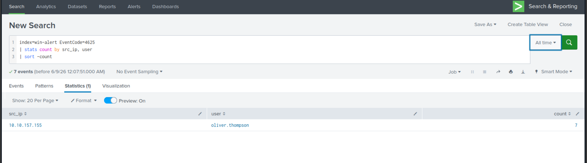
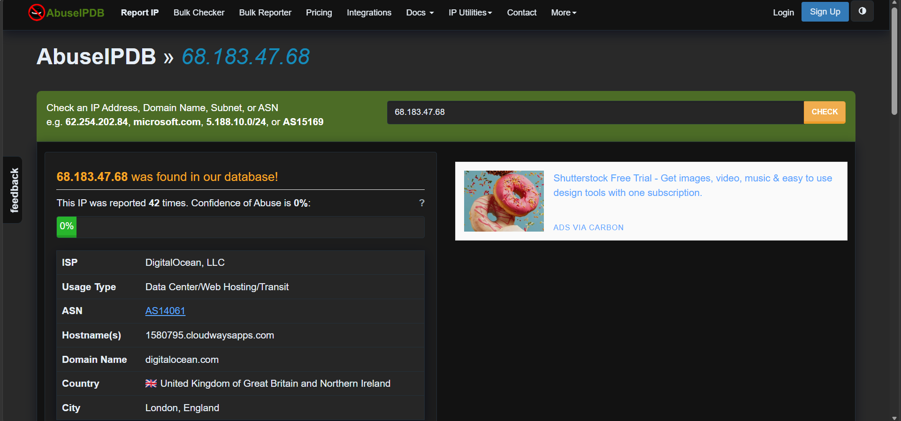
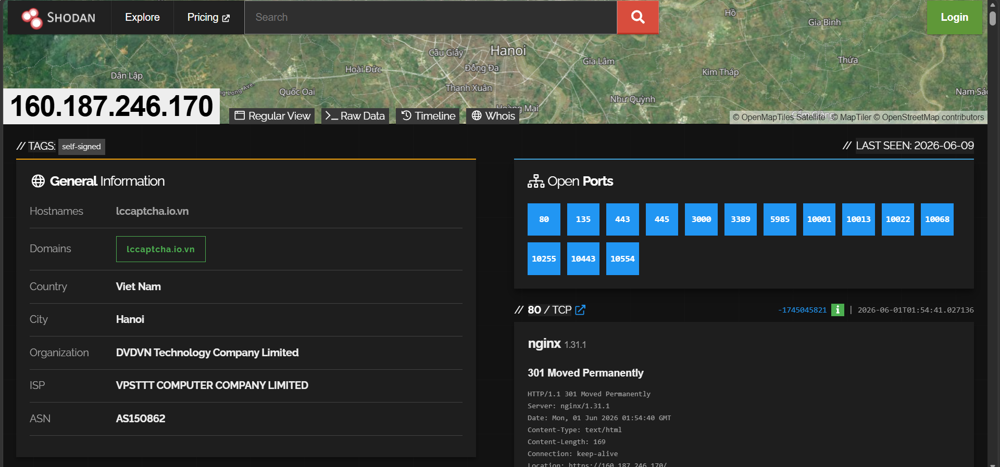

# Module 5 — Threat Intelligence

**Focus:** IOC Correlation & Threat Actor Profiling  
**Analyst:** Ilyas Hodaiby  
**Status:** Complete ✅

---

## Overview

This module correlates IOCs discovered during the 5 threat hunts against threat intelligence sources to identify threat actors, campaigns, and infrastructure patterns.

---

## IOC Enrichment Results

### IP Reputation Analysis

| IP | Country | ASN | Reputation | Source |
|----|---------|-----|------------|--------|
| 171.251.232.40 | Vietnam 🇻🇳 | AS7552 Viettel | 1/91 Malicious | VirusTotal |
| 68.183.47.68 | UK 🇬🇧 | AS14061 DigitalOcean | 42 reports | AbuseIPDB |
| 160.187.246.170 | Vietnam 🇻🇳 | AS150862 | 15 open ports | Shodan |






---

## Threat Actor Profiling

### Actor 1 — WordPress Attacker (171.251.232.40)

**Profile:**
- Uses Hydra for automated credential attacks
- Targets WordPress installations
- Deploys web shells disguised as cron files
- Establishes persistent C2 via POST requests
- TTPs match opportunistic cybercriminal profile

**Campaign Pattern:**
Reconnaissance → Brute Force → Web Shell → C2 → Data Access

**MITRE ATT&CK Profile:**
- T1190 — Exploit Public-Facing Application
- T1110 — Brute Force
- T1505.003 — Web Shell
- T1071.001 — C2 via HTTP

---

### Actor 2 — Windows Attacker (Cybertees\James)

**Profile:**
- Internal threat actor or compromised insider account
- Uses living-off-the-land techniques (WMIC, net.exe)
- Creates backdoor accounts with predictable passwords
- Operates via WMI for remote execution
- TTPs match lateral movement playbook

**Campaign Pattern:**
Initial Access → WMI Execution → Account Creation → Persistence

**MITRE ATT&CK Profile:**
- T1047 — WMI Execution
- T1136.001 — Create Local Account
- T1078 — Valid Accounts
- T1021 — Remote Services

---

## MISP Threat Intelligence Integration

```python
# IOC submission to MISP
import requests

misp_url = "https://misp.local"
misp_key = "YOUR_API_KEY"

iocs = [
    {"type": "ip-dst", "value": "171.251.232.40"},
    {"type": "ip-dst", "value": "68.183.47.68"},
    {"type": "url", "value": "/wp-corn.php"},
    {"type": "filename", "value": "svchost32.exe"},
    {"type": "domain", "value": "update-service.xyz"}
]

for ioc in iocs:
    payload = {
        "Attribute": {
            "event_id": "1",
            "type": ioc["type"],
            "value": ioc["value"],
            "comment": "Threat Hunting Lab — IR-2025-001"
        }
    }
    response = requests.post(
        f"{misp_url}/attributes/add/1",
        headers={"Authorization": misp_key},
        json=payload
    )
```

---

## Threat Feeds Used

| Feed | Type | Purpose |
|------|------|---------|
| VirusTotal | IP/Hash reputation | Malware identification |
| AbuseIPDB | IP reputation | C2 infrastructure |
| Shodan | IP scanning data | Attack surface |
| MITRE ATT&CK | TTP mapping | Technique identification |
| AlienVault OTX | IOC correlation | Campaign tracking |

---

## IOC Summary — All Hunts
NETWORK IOCs:
├── 10.10.157.155    — Brute force source (H01, H03)
├── 10.14.94.82      — Secondary attacker (H01, H03)
├── 171.251.232.40   — WordPress attacker (H04, H05)
├── 68.183.47.68     — C2 infrastructure (H05)
└── 160.187.246.170  — IoT scanner (H04)
HOST IOCs:
├── A1berto          — Backdoor account (H02)
├── paw0rd1          — Hardcoded password (H02)
├── svchost32.exe    — Fake system binary (H02)
└── wp-corn.php      — Web shell/C2 (H04, H05)
BEHAVIORAL IOCs:
├── Mozilla/5.0 (Hydra)   — Attack tool UA
├── EventCode 4625 x7     — Brute force pattern
├── POST /wp-corn.php     — C2 beaconing
└── net user /add         — Account creation

---

## Detection Rules Based on TI

### Splunk — Known Attacker IP Alert
```splunk
index=* src_ip IN (
    "171.251.232.40",
    "68.183.47.68",
    "10.10.157.155",
    "10.14.94.82"
)
| eval alert="Known attacker IP detected"
| table _time, src_ip, dest_ip, alert
```

### Splunk — IOC Feed Lookup
```splunk
index=*
| rex field=_raw "(?<src_ip>\d+\.\d+\.\d+\.\d+)"
| lookup threat_intel_ips ip as src_ip
    OUTPUT threat_level, actor, campaign
| where isnotnull(threat_level)
| table _time, src_ip, threat_level, actor
```

---

## Recommendations

1. Subscribe to commercial threat feeds (Recorded Future, CrowdStrike)
2. Integrate MISP with Splunk for automated IOC matching
3. Block all identified attacker IPs at perimeter firewall
4. Share IOCs with sector ISAC for community defence
5. Implement automated IOC enrichment in SOAR pipeline
